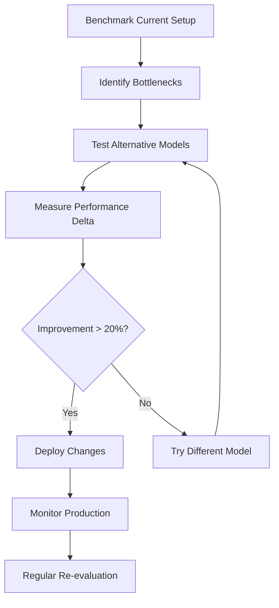

# LLM Performance Primer 🧠⚡

**Understanding Local LLM Performance Characteristics for uroboro Development**

## 🎯 Overview

This primer explains the key performance metrics, model characteristics, and trade-offs you need to understand when selecting local LLMs for uroboro and Go tooling integration.

## 📏 Model Size & Architecture Fundamentals

### Parameter Count Impact

| Model Size | Parameters | RAM Required | Typical Use Case | Speed | Quality |
|------------|------------|--------------|------------------|-------|---------|
| **3B** | 3 billion | 4-6 GB | Quick tasks, real-time | ⚡⚡⚡ | ⭐⭐⭐ |
| **7B** | 7 billion | 8-12 GB | Balanced workflows | ⚡⚡ | ⭐⭐⭐⭐ |
| **13B** | 13 billion | 16-20 GB | High-quality content | ⚡ | ⭐⭐⭐⭐⭐ |
| **30B+** | 30+ billion | 32+ GB | Research/specialized | 🐌 | ⭐⭐⭐⭐⭐ |

### Why Size Matters for uroboro

```bash
# Quick capture scenario (interrupt-driven development)
orca-mini:3b → 500-1500ms  ✅ No flow state disruption
mistral:7b   → 2-5s        ⚠️  Noticeable delay  
llama2:13b   → 5-15s       ❌ Breaks development flow

# Blog post generation (quality-focused, time available)
orca-mini:3b → 500ms  ❌ Poor quality, needs editing
mistral:7b   → 3s     ⚠️  Decent quality
llama2:13b   → 10s    ✅ Professional quality, minimal editing
```

## ⚡ Performance Metrics That Matter

### 1. **Latency Characteristics**

#### Time to First Token (TTFT)
- **What it is**: Delay before model starts generating
- **Why it matters**: User perception of responsiveness
- **uroboro impact**: Critical for capture operations during development

#### Tokens Per Second (TPS)
- **What it is**: Generation speed after first token
- **Why it matters**: Total completion time for longer content
- **uroboro impact**: Blog post and devlog generation efficiency

#### Total Response Time 
- **Formula**: TTFT + (Total Tokens ÷ TPS)
- **Practical ranges**:
  - **Capture**: 50-200 tokens → Target <2s total
  - **Social**: 100-300 tokens → Target <5s total  
  - **Devlog**: 300-800 tokens → Target <15s total
  - **Blog**: 800-2000 tokens → Target <30s total

### 2. **Quality Metrics**

#### Coherence Score
- **Measurement**: Logical flow and consistency
- **Impact**: Reduces manual editing time
- **Trade-off**: Higher quality models = slower generation

#### Technical Accuracy
- **Measurement**: Correct terminology, concepts, syntax
- **Critical for**: uroboro's technical content generation
- **Model specialization**: Code-focused models (CodeLlama) vs general models

#### Format Compliance
- **Measurement**: Adherence to markdown, HTML, structured output
- **Impact**: Integration complexity with uroboro's formatting pipeline
- **Variation**: Some models better at following format instructions

### 3. **Resource Efficiency**

#### Memory Usage Patterns
```
Model Loading:    mistral:7b → ~4GB VRAM/RAM
Active Inference: mistral:7b → +2-4GB during generation
Peak Usage:       mistral:7b → ~8GB total
```

#### CPU vs GPU Utilization
- **CPU-only**: Slower but universal compatibility
- **GPU-accelerated**: 3-10x faster but hardware dependent
- **Mixed mode**: Offload layers based on available VRAM

## 🏗 Model Architecture Impact

### Transformer Variants

#### Standard Transformers (Llama 2, Mistral)
- **Strengths**: Well-rounded performance, broad knowledge
- **Weaknesses**: No task-specific optimizations
- **Best for**: General uroboro content generation

#### Code-Specialized Models (CodeLlama, StarCoder)
- **Strengths**: Better code understanding, technical accuracy
- **Weaknesses**: May be verbose for simple tasks
- **Best for**: Technical devlogs, architecture documentation

#### Chat-Optimized Models (Neural Chat, Zephyr)
- **Strengths**: Conversational, engaging tone
- **Weaknesses**: May be too casual for professional content
- **Best for**: Social media posts, informal updates

#### Instruction-Tuned Models (Dolphin, Orca)
- **Strengths**: Better prompt following, consistent formatting
- **Weaknesses**: May lack creativity
- **Best for**: Structured content, consistent output format

## 📊 Benchmarking Methodology

### Performance Testing Framework

#### 1. **Baseline Measurements**
```go
type Benchmark struct {
    Model          string
    PromptTokens   int
    OutputTokens   int
    TTFT          time.Duration
    TotalTime     time.Duration
    PeakMemory    int64
    QualityScore  float64
}
```

#### 2. **Test Scenarios by Use Case**

**Capture Benchmarks** (Speed Priority)
- Prompt: 20-50 tokens
- Expected output: 50-150 tokens  
- Success criteria: <2s total time, readable output
- Test variations: Bug fixes, features, optimizations

**Devlog Benchmarks** (Accuracy Priority)
- Prompt: 100-200 tokens
- Expected output: 300-800 tokens
- Success criteria: Technical accuracy, proper formatting
- Test variations: Architecture, debugging, implementation

**Blog Benchmarks** (Quality Priority)  
- Prompt: 150-300 tokens
- Expected output: 800-2000 tokens
- Success criteria: Professional quality, minimal editing needed
- Test variations: Technical tutorials, project retrospectives

**Social Benchmarks** (Engagement Priority)
- Prompt: 50-100 tokens  
- Expected output: 100-300 tokens
- Success criteria: Engaging tone, appropriate hashtags
- Test variations: Achievements, learning experiences

### 3. **Quality Assessment Rubric**

#### Automated Metrics
```go
func EvaluateQuality(output string, expected OutputType) QualityScore {
    return QualityScore{
        TechnicalAccuracy: checkTerminology(output),
        FormatCompliance:  validateMarkdown(output),
        Completeness:     checkTopicCoverage(output),
        Readability:      calculateReadabilityScore(output),
        Length:          assessLengthAppropriate(output, expected),
    }
}
```

#### Human Evaluation (Sample-Based)
- **Blind comparison**: Same prompt across multiple models
- **Ranking system**: 1-5 scale for each quality dimension
- **Use case fit**: How well does output match intended use
- **Edit time**: Minutes required to make output publishable

## 🎛 Performance Tuning Parameters

### Model-Level Configuration

#### Temperature Settings
```bash
# Conservative (consistent, predictable)
temperature: 0.1-0.3  # Good for: Technical documentation, structured content

# Balanced (natural, some creativity) 
temperature: 0.7-0.8  # Good for: Blog posts, social content

# Creative (diverse, engaging)
temperature: 0.9-1.0  # Good for: Marketing copy, creative writing
```

#### Context Window Utilization
- **Short context** (512-1024 tokens): Faster, less memory
- **Medium context** (2048-4096 tokens): Balanced performance
- **Long context** (8192+ tokens): Slower but better understanding

#### Sampling Parameters
```yaml
top_p: 0.9        # Nucleus sampling for coherence
top_k: 40         # Limit vocabulary for consistency  
repeat_penalty: 1.1  # Avoid repetitive output
max_tokens: 500   # Control output length
```

### System-Level Optimization

#### Memory Management
```bash
# Model quantization for memory efficiency
fp16: ~50% memory reduction, minimal quality loss
int8: ~75% memory reduction, slight quality loss  
int4: ~87% memory reduction, noticeable quality loss
```

#### Concurrent Processing
```go
// Connection pooling for multiple requests
type ModelPool struct {
    models map[string]*Model
    queue  chan Request
    workers int
}

// Load balancing across models
func (p *ModelPool) SelectModel(task TaskType) *Model {
    // Route based on current load and task requirements
}
```

## 🔀 Trade-off Analysis

### Speed vs Quality Matrix

| Scenario | Speed Need | Quality Need | Recommended Model Type |
|----------|------------|--------------|----------------------|
| **Live capture** | ⚡⚡⚡ | ⭐⭐ | 3B, high temp |
| **Quick devlog** | ⚡⚡ | ⭐⭐⭐ | 7B, med temp |
| **Professional blog** | ⚡ | ⭐⭐⭐⭐⭐ | 13B, low temp |
| **Social content** | ⚡⚡ | ⭐⭐⭐ | 7B chat, high temp |

### Cost-Benefit Analysis

#### Hardware Investment
```
Entry Level:  16GB RAM → 7B models max
Mid-Range:    32GB RAM → 13B models comfortable  
High-End:     64GB RAM → Multiple models, experimenting
```

#### Development Productivity Impact
```
Fast Models (3B):
  + Zero flow disruption during capture
  + Rapid iteration cycles
  - More editing time required
  
Balanced Models (7B):
  + Good enough quality for most uses
  + Reasonable speed for regular use
  - May need quality pass for important content
  
Quality Models (13B):
  + Minimal editing required
  + Professional output quality
  - Too slow for real-time use
```

## 🎯 uroboro-Specific Considerations

### Integration Architecture

#### Single Model Strategy
```go
// Simple but inflexible
service := NewPublishService("mistral:latest")
```

#### Multi-Model Strategy  
```go
// Flexible but complex
service := NewPublishServiceWithModels(map[string]string{
    "capture": "orca-mini:3b",
    "devlog":  "codellama:7b", 
    "blog":    "llama2:13b",
    "social":  "neural-chat:7b",
})
```

#### Adaptive Strategy
```go
// Intelligent selection based on context
func (s *Service) SelectModel(task Task) string {
    if task.IsUrgent() && task.Length() < 200 {
        return "orca-mini:3b"
    }
    if task.IsTechnical() {
        return "codellama:7b"  
    }
    return s.defaultModel
}
```

### Workflow Integration Points

#### Capture Workflow
- **Trigger**: Manual command or git hook
- **Performance requirement**: <2s response time
- **Quality requirement**: Readable, accurate summary
- **Optimal model**: 3B fast model with technical training

#### Publish Workflow  
- **Trigger**: Deliberate content generation
- **Performance requirement**: <30s for quality content
- **Quality requirement**: Minimal editing needed
- **Optimal model**: Task-specific 7B-13B models

#### Status Workflow
- **Trigger**: Periodic review/reporting
- **Performance requirement**: <10s for overviews
- **Quality requirement**: Well-formatted, comprehensive
- **Optimal model**: Balanced 7B model

## 📈 Monitoring & Optimization

### Key Performance Indicators

#### System Metrics
```go
type PerformanceMetrics struct {
    ResponseTime    time.Duration
    MemoryUsage     int64
    CPUUtilization  float64
    ThroughputTPS   float64
    ErrorRate       float64
    QueueDepth      int
}
```

#### Quality Metrics  
```go
type QualityMetrics struct {
    EditTime        time.Duration  // How long to make publishable
    UserSatisfaction float64       // 1-5 rating
    TechnicalAccuracy float64      // Automated check
    FormatCompliance  float64      // Markdown/structure validation
}
```

### Continuous Optimization

#### A/B Testing Framework
```go
type ABTest struct {
    ModelA      string
    ModelB      string  
    UserVotes   map[string]int
    Metrics     map[string]float64
    Duration    time.Duration
}
```

#### Performance Regression Detection
```go
func DetectRegression(current, baseline Metrics) bool {
    return current.ResponseTime > baseline.ResponseTime*1.2 ||
           current.QualityScore < baseline.QualityScore*0.9
}
```

## 🚀 Practical Recommendations

### Getting Started Checklist

1. **Hardware Assessment**
   - [ ] Measure available RAM: `free -h`
   - [ ] Check CPU cores: `nproc`
   - [ ] Test basic Ollama performance: `ollama run mistral:latest "Hello world"`

2. **Baseline Establishment**
   - [ ] Time current uroboro operations
   - [ ] Rate current output quality (1-5 scale)
   - [ ] Document editing time required

3. **Model Selection Strategy**
   - [ ] Start with balanced 7B model (mistral:latest)
   - [ ] Add fast 3B model for captures (orca-mini:3b)
   - [ ] Experiment with specialized models for each use case

4. **Performance Monitoring**
   - [ ] Log response times per operation
   - [ ] Track user satisfaction scores
   - [ ] Monitor system resource usage

### Optimization Workflow



---

**🎯 Key Takeaway**: The best LLM setup for uroboro balances speed for interruption-free development with quality for professional content generation. Start with benchmarks, measure what matters, and optimize based on your actual usage patterns.

*Ready to run some benchmarks? Use this primer as your guide when interpreting the experimental results!*