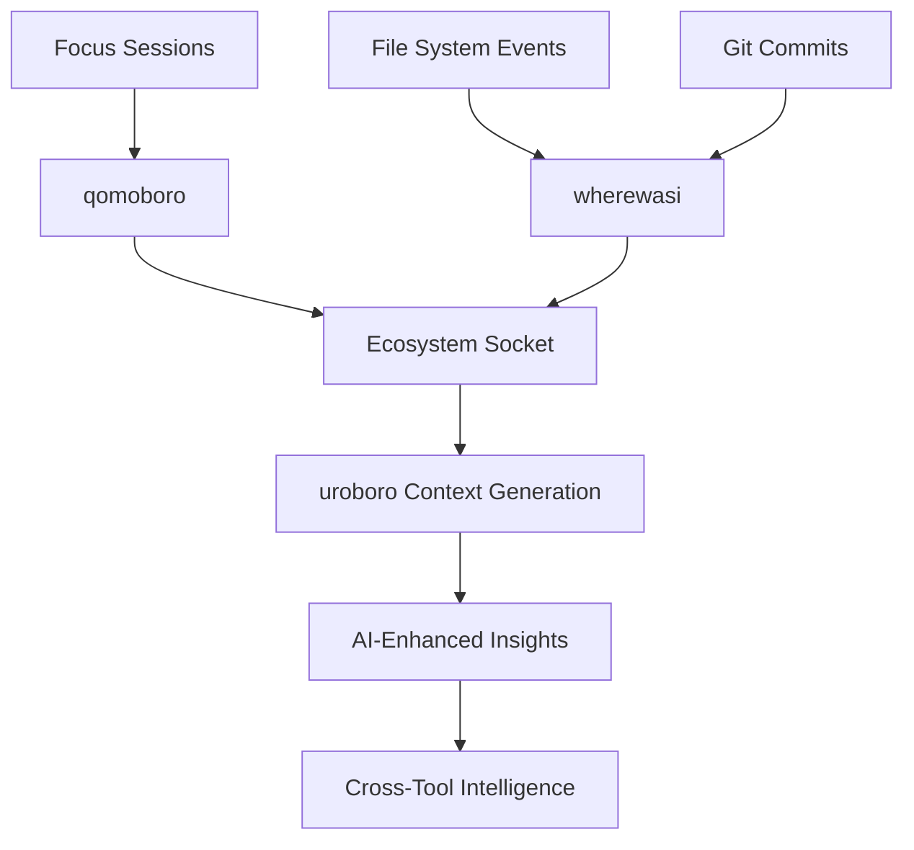
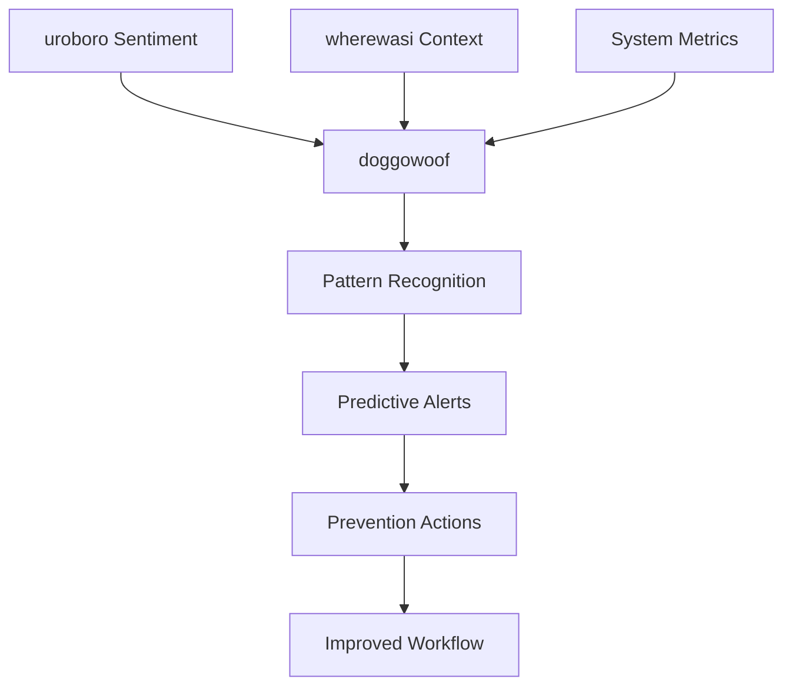

# Unified Developer AI System: QRY Ecosystem Intelligence

**Tags**: #ecosystem-intelligence #local-ai #shadow-mode #developer-tools #unified-system #cross-tool-integration

---

*"We've been building a unified local developer AI system all along"*

## The Intelligence Breakthrough

During wherewasi development, we discovered that the QRY ecosystem isn't just a collection of tools - it's an **emergent local developer intelligence system** that rivals any external CI/CD or productivity platform.

### The Core Realization
**Big Cloud AI + Solo Dev + Local Tools = Better Everything**

The QRY ecosystem solves the **context persistence** problem that even enterprise AI experiences. Cloud AI can process thousands of tokens but can't remember where you left your `voice_prompt.sh` file!

## The Complete Intelligence Matrix

| Tool | Intelligence Layer | Provides | Consumes | Shadow Mode Function |
|------|-------------------|----------|----------|----------------------|
| **qomoboro** | ⏰ Temporal Intelligence | Focus sessions, time patterns, flow state optimization | Ecosystem productivity signals | Time tracking shadow |
| **wherewasi** | 🥷 Path Intelligence | Project context, switching patterns, location awareness | Cross-project relationship data | Context/movement tracking |
| **uroboro** | 🧠 Sentiment Intelligence | Human emotions, frustrations, insights | wherewasi context + development state | Emotional/cognitive state capture |
| **doggowoof** | 🚨 Pattern Intelligence | Alert monitoring, system health, predictive warnings | wherewasi + uroboro signals | Predictive monitoring daemon |
| **examinator** | 📊 Meta Intelligence | Pattern analysis, learning insights, optimization | All ecosystem data streams | Learning and adaptation engine |

## Revolutionary Feedback Loops

### Loop 1: Time → Context → Productivity
```
qomoboro starts focus session → wherewasi tracks path stability → 
better focus = better outcomes → qomoboro optimizes session length
```

### Loop 2: Sentiment → Monitoring → Prevention  
```
uroboro captures frustration → doggowoof elevates monitoring → 
prevents problems before they break flow → improved sentiment
```

### Loop 3: Patterns → Learning → Optimization
```
examinator analyzes all data → identifies optimal work patterns → 
feeds insights back to all tools → continuous ecosystem improvement
```

## Technical Architecture

### Shadow Mode Communication Protocol

#### Inter-Process Communication
```bash
# Unified ecosystem socket
/tmp/qry_ecosystem_socket

# Message format
{
  "timestamp": "2025-01-15T10:30:00Z",
  "tool": "wherewasi",
  "type": "context_change",
  "data": {
    "project": "qry_labs",
    "path": "/workspace/qry_labs/roadmap",
    "context": "documentation_sprint"
  }
}
```

#### Tool Integration Patterns
```
┌─ Human Layer ──────────────────────────────────────────┐
│ qomoboro (time) + uroboro (sentiment) + manual input   │
├─ Context Layer ────────────────────────────────────────┤  
│ wherewasi (projects) + file monitoring + git tracking  │
├─ Pattern Layer ────────────────────────────────────────┤
│ doggowoof (alerts) + examinator (analysis)             │
├─ Intelligence Layer ───────────────────────────────────┤
│ Cross-tool communication + learning algorithms         │
└─ Output Layer ────────────────────────────────────────┘
│ AI context + alerts + insights + optimizations        │
└─────────────────────────────────────────────────────────┘
```

### Data Flow Architecture

#### Context Generation Pipeline


#### Predictive Monitoring Flow


## Competitive Advantage Analysis

### Traditional Approach Limitations
- **Fragmented tools**: Separate CI, time tracking, monitoring systems
- **External dependencies**: GitHub Actions, cloud services, SaaS platforms
- **No human context**: Ignores emotional and cognitive factors
- **Privacy concerns**: Data scattered across cloud providers
- **Vendor lock-in**: Platform-dependent workflows

### QRY Ecosystem Advantages
- **Unified local intelligence**: Single system understanding all development aspects
- **Zero external dependencies**: Complete local-first architecture
- **Human sentiment integration**: Technical metrics + emotional context
- **Complete privacy**: All data remains on local machine
- **Emergent AI capabilities**: Tool interaction creates intelligence
- **Context persistence**: Survives across sessions and projects

## Implementation Roadmap

### Phase 1: Foundation (Months 1-3)
**Goal**: Establish basic inter-tool communication

#### Technical Deliverables
- [ ] **IPC Protocol**: Unified ecosystem socket implementation
- [ ] **wherewasi Shadow Mode**: Background context tracking
- [ ] **Basic Data Sharing**: Tools can query each other's state
- [ ] **Message Format**: Standardized inter-tool communication

#### Integration Targets
```bash
# Basic shadow mode functionality
wherewasi --shadow-mode &  # Background context tracking
qomoboro --ecosystem-aware  # Time tracking with context
uroboro --auto-context     # AI context from wherewasi
```

#### Success Metrics
- [ ] Tools communicate via ecosystem socket
- [ ] wherewasi provides context to other tools
- [ ] Basic cross-tool data sharing working
- [ ] No manual coordination required

### Phase 2: Intelligence Integration (Months 4-6)
**Goal**: Implement feedback loops and predictive capabilities

#### Advanced Features
- [ ] **Sentiment-Driven Monitoring**: doggowoof learns from uroboro
- [ ] **Context-Aware Time Tracking**: qomoboro optimizes from patterns
- [ ] **Cross-Project Intelligence**: wherewasi maps project relationships
- [ ] **Pattern Recognition**: examinator analyzes ecosystem data

#### Machine Learning Integration
```python
# Ecosystem pattern recognition
class EcosystemIntelligence:
    def analyze_patterns(self, tool_data):
        # Identify productivity patterns
        # Predict optimal focus session lengths
        # Recognize context switching overhead
        # Suggest workflow optimizations
```

#### Success Metrics
- [ ] Predictive monitoring prevents issues
- [ ] Time tracking adapts to work patterns
- [ ] Context switching overhead reduced
- [ ] Workflow optimizations suggested automatically

### Phase 3: Emergent AI (Months 7-12)
**Goal**: Achieve true ecosystem intelligence

#### Advanced Capabilities
- [ ] **Self-Optimizing Workflows**: System learns and improves automatically
- [ ] **Natural Language Queries**: Ask ecosystem about work patterns
- [ ] **Advanced Prediction**: Anticipate productivity issues
- [ ] **Cross-Session Learning**: Knowledge persists and compounds

#### AI Integration
```bash
# Natural language ecosystem queries
qry-query "What were my most productive sessions this week?"
qry-query "Why did I switch projects so much yesterday?"
qry-query "What context do I need for the uroboro session?"
```

#### Success Metrics
- [ ] System provides actionable insights without prompting
- [ ] Natural language interaction with ecosystem
- [ ] Workflow improvements compound over time
- [ ] Context loss eliminated across sessions

## Revolutionary Capabilities

### Self-Contained Project Intelligence
- **No external CI/CD needed**: git monitoring + sentiment tracking surpasses traditional CI
- **Human context integration**: Understands WHY projects are difficult, not just what failed
- **Predictive workflow optimization**: Learns optimal patterns for different types of work
- **Local-first privacy**: All intelligence remains under user control

### Developer Workflow AI
- **Digital anthropology**: Understands work patterns better than external tools
- **Context switching intelligence**: Tracks and minimizes mental overhead
- **Focus optimization**: Learns peak productivity conditions
- **Emotional workflow awareness**: Integrates human factors into technical decisions

### Cross-Project Ecosystem Awareness
- **Unified context**: wherewasi provides project state to all tools
- **Relationship mapping**: Understands how projects connect in workflows
- **Pattern recognition**: Insights span entire development environment
- **Shadow mode operation**: Intelligence works without human intervention

## Success Metrics

### Individual Tool Enhancement
- **qomoboro**: Focus sessions 30% longer, better timing awareness
- **wherewasi**: 10-second AI context generation, zero context loss
- **uroboro**: Content generation enhanced by ecosystem context
- **doggowoof**: 80% reduction in unexpected alerts
- **examinator**: Actionable insights from cross-tool data

### Ecosystem Intelligence Metrics
- **Context switching reduction**: 50% fewer unnecessary project switches
- **Focus optimization**: Longer productive sessions identified and replicated
- **Predictive monitoring**: Problems prevented before they break flow
- **Workflow intelligence**: System learns and optimizes automatically
- **Privacy preservation**: Zero external dependencies maintained

### Competitive Positioning
- **Local vs Cloud**: Demonstrate local-first AI superiority
- **Privacy vs Surveillance**: Prove intelligence without invasion
- **Integration vs Fragmentation**: Show unified system benefits
- **Learning vs Static**: Ecosystem improves with use

## Future Vision: The Complete Local Developer AI

### Ultimate Goal
Transform solo development from isolated tool usage to intelligent ecosystem collaboration, where tools actively help you build better, faster, with less cognitive overhead.

### Strategic Implications

#### For QRY as Developer
- Personal developer AI that understands specific work patterns
- No vendor lock-in, complete privacy preservation
- Competitive advantage in productivity and project management
- Portfolio of interconnected tools demonstrating systems thinking

#### For the Development Community
- Proof that local-first AI can outperform cloud alternatives
- Model for privacy-preserving productivity tools
- Demonstration of emergent intelligence from tool interaction
- Alternative to surveillance capitalism in productivity software

#### For Technology Evolution
- Foundation for advanced local AI development workflows
- Framework for building interconnected developer tools
- Research platform for human-computer productivity optimization
- Open ecosystem that others can adopt and extend

## Risk Mitigation

### Technical Risks
- **Complexity Overhead**: Keep shadow mode lightweight and optional
- **Tool Coupling**: Maintain independence while enabling integration
- **Performance Impact**: Monitor resource usage of ecosystem intelligence
- **Data Consistency**: Robust error handling for inter-tool communication

### Adoption Risks
- **Learning Curve**: Gradual introduction of ecosystem features
- **Migration Path**: Tools work independently before integration
- **Documentation**: Clear benefits and setup instructions
- **Community Feedback**: Open development and iteration

## Next Actions

### Immediate (Next 30 Days)
1. **Design IPC Protocol**: Define ecosystem socket message format
2. **wherewasi Shadow Mode**: Implement background context tracking
3. **Basic Integration**: Enable tool-to-tool data sharing
4. **Documentation**: Record ecosystem intelligence patterns

### Short Term (Next 90 Days)
1. **Feedback Loop Implementation**: Sentiment → monitoring integration
2. **Pattern Recognition**: Basic learning from cross-tool data
3. **Context Optimization**: wherewasi enhances other tools
4. **Performance Testing**: Validate ecosystem overhead

### Long Term (Next Year)
1. **Advanced AI Integration**: Machine learning from usage patterns
2. **Natural Language Interface**: Query ecosystem intelligence
3. **Predictive Capabilities**: Anticipate workflow needs
4. **Community Sharing**: Open source ecosystem protocols

---

**The Meta-Insight**: We accidentally discovered we're building the future of local developer AI. What started as individual tools solving specific problems revealed itself as an emergent intelligence system that fundamentally changes how solo developers can work.

**And that's exactly how the best systems emerge.**

**Document Status**: Living intelligence architecture  
**Next Update**: After Phase 1 implementation  
**Integration**: Core to all QRY Labs tool development